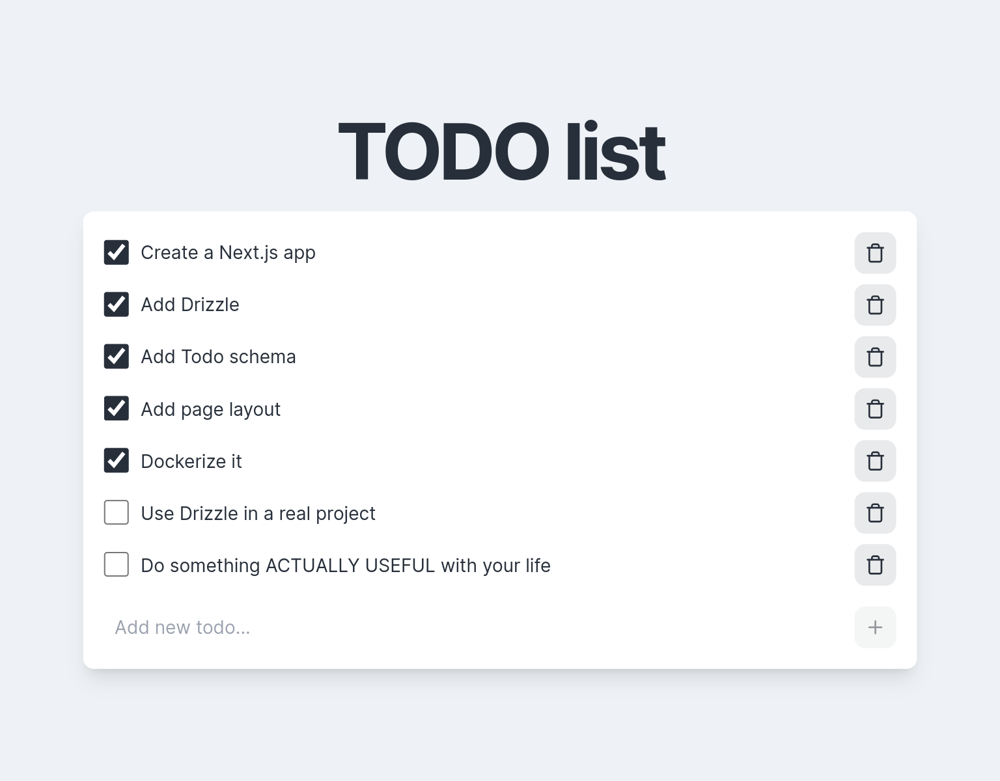

# Next.js + Drizzle test TODO app

This is a test TODO app, built with [Next.js](https://nextjs.org/) and [Drizzle ORM](https://orm.drizzle.team/) for the purpose of learning Drizzle.

This project uses [Docker](https://www.docker.com/) to run the Next.js app itself, as well as a local Postgres DB and Drizzle Studio.



## Running the project

First, copy the contents of `.env.example` into a new `.env` file.

With the default values, the local Postgres DB run with Docker will be used. If you want to use a different database, feel free to change these values.

Now run both the local DB and the Next app with Docker Compose:

```bash
docker compose up -d
```

Open [localhost:3000](http://localhost:3000) in your browser to see the app. \
You can also view the database in Drizzle Studio at [local.drizzle.studio](https://local.drizzle.studio/).
